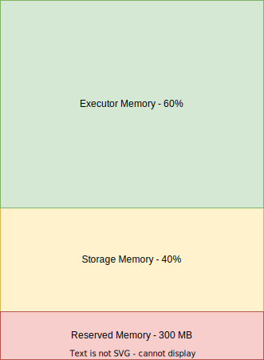
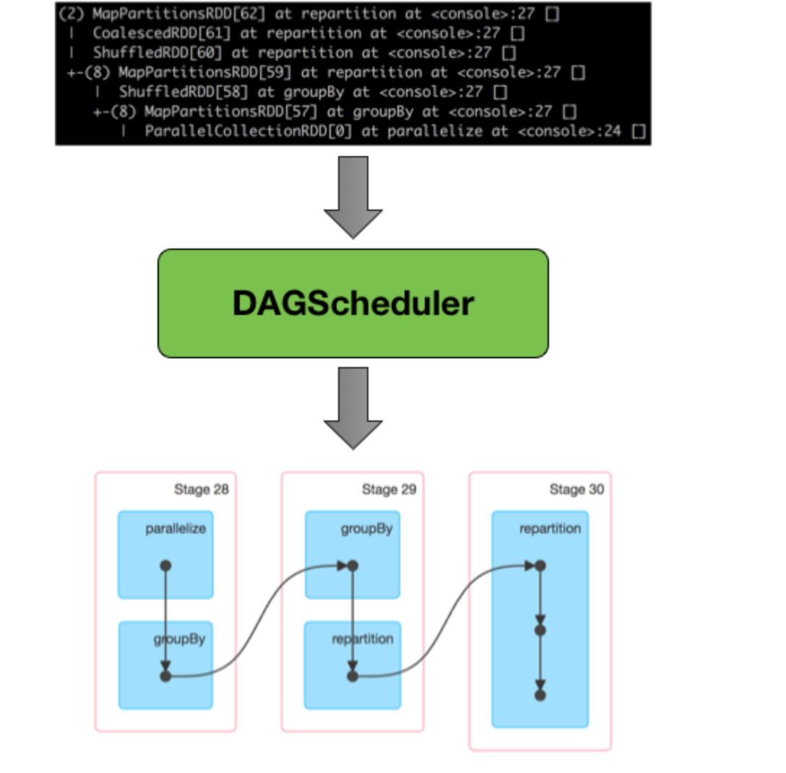
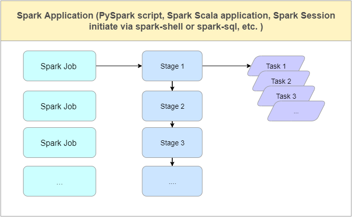

# What
Spark is a unified library for large-scale distributed data processing.

## Why is it special?
Spark supports batch processing, stream processing, machine learning, graph algorithms, 
SQL, etc...

Transformations occur in-memory, making it faster than MapReduce.

## High-Level Architecture

### Cluster

**Driver:** The entrypoint to the cluster that does the following: converts spark code to tasks, assigns tasks to Executors, handles task failures, and returns result to client. 

**Cluster manager:** It allocates resources(CPU, memory, storage) to the worker nodes and driver node. The types of managers are standalone, Mesos, Yarn, K8s

**Worker Node:** Physical or Virtual machine in the cluster that provides the environment and resource(CPU, memory, storage) 
for executors to run.

**Executor:** JVM process that executes tasks assigned by the Driver.

**Slots:** Fancy name for executor cores. Typically 1 slot<--->1 task<--->1 partition. 
So If I have 4 executors with 4 slots, I can run 16 tasks in parallel

#### Executor memory Breakdown

Execution memory stores temporary data used for shuffles, joins, sorts, aggregations. If data exceeds memory, it will spill onto disk.

Storage memory is used for cached data, broadcasts.

Reserved memory is used to prevent OOM issues.

### Execution Engine

**Transformation:** Operations like filter, select, join, groupBy. They are "lazy" and will not execute until a spark action is invoked.
* Narrow Transformations: Transformations that each input partition contributes to only one output partition. Generally more efficient and faster.
* Wide Transformations: Transformations where input data from multiple partitions may be combined to produce each output partition. This means they require
a shuffle, which involves disk I/O, network I/O, and serialization/deserialization of the data.

**Action:** Operations like save, show, and count. Once an action is invoked, Spark will evaluate the lineage of transformations that were lazily stored.

**Logical Plan:** Each transformation builds upon a logical plan, a tree of logical operations and high level abstraction
of what the user wants to do. After the plan is constructed, the catalyst optimizer creates a logical optimized plan (filter pushdowns, etc...)

**Physical Plan:** How the optimized logical plan will be executed in the cluster. It is represented as a DAG. 

**Job:** Represents the entire computation required to produce results for an action. A job consists of 1 or more stages.

**Stage:** Each stage contains a sequence of transformations that can be completed without shuffling, shuffles mark the boundary of 
an individual stage. A stage has multiple tasks that can be executed in parallel.

**Task:** A unit of work that will be performed by the executor and corresponds to 1 slot and 1 partition. 
 Once all tasks are complete for the job, the final result will be returned to the Driver or written to disk.

## Performance bottlenecks

I/O caused by:

Shuffle, Skew, Spill

TODO: Write more about this
